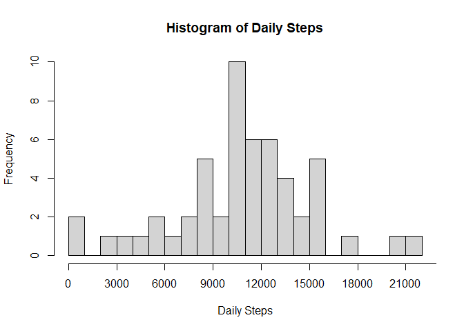

## Activity Analysis with Missing Values

Before we start our analysis, we will open the "activity.csv" file in the project folder.


```r
act<-read.csv("activity.csv")
act$date<-as.Date(act$date)
```

Now that we have the data we can start our analysis. Here is a histogram of the total number of steps taken each day.  


```r
dailysteps<-tapply(act$steps,act$date,sum)
xnum<-seq(0,24000,3000)
hist(dailysteps,main="Histogram of Daily Steps", 
     xlab="Daily Steps", breaks=20,xaxt="n")
axis(side=1,at=xnum,labels=xnum)
```

<!-- -->

Let's calculate the mean and median of total number of steps taken per day.


```r
dailymean<-mean(dailysteps,na.rm=TRUE)
dailymean<-format(round(dailymean,2),nsmall=2)
```


```r
dailymed<-median(dailysteps,na.rm=TRUE)
dailymed<-format(round(dailymed,0),nsmall=0)
```

The mean and median of total number of steps are 10766.19 and 10765.

Next, we will make a time series plot of the average number of steps taken, averaged across all days.


```r
intrvls<-unique(act$interval)
xnum<-seq(0,2400,300)
intervalmean<-tapply(act$steps,act$interval,mean,na.rm=TRUE)
plot(intrvls,intervalmean,type="l",main="Time Series of Average Steps", 
     xlab="5 Minute Interval", ylab="Average Number of Steps", xaxt="n")
axis(side=1,at=xnum,labels=xnum)
```

<!-- -->

As we can see the maximum of the average number of steps is reached at around interval 800. Let's find at what interval we are reaching the maximum value.


```r
maxatinterval<-intrvls[which.max(intervalmean)]
```

The maximum value for average number of steps is reached at interval 835.

## Activity Analysis After Imputing Missing Values

There are some days/intervals where the number of steps is missing, denoted by NA. We would like to use a reasonable value, in this case mean for the given interval, to fill in all missing values.


```r
library(dplyr)
act<-act %>% group_by(interval) %>%  
    mutate(steps=ifelse(is.na(steps),round(mean(steps,na.rm=T),0),steps))
```

Now that we have filled in all missing values, let's graph a histogram of the total number of steps taken each day with the updated data set.


```r
dailysteps<-tapply(act$steps,act$date,sum)
xnum<-seq(0,24000,3000)
ynum<-seq(0,20,5)
hist(dailysteps,main="Histogram of Daily Steps Without Missing Values", 
     xlab="Daily Steps", breaks=20,xaxt="n")
axis(side=1,at=xnum,labels=xnum)
axis(side=2,at=ynum,labels=ynum)
```

<!-- -->

Let's now calculate the mean and median of total number of steps taken per day.


```r
dailymean<-mean(dailysteps,na.rm=TRUE)
dailymean<-format(round(dailymean,2),nsmall=2)
```


```r
dailymed<-median(dailysteps,na.rm=TRUE)
dailymed<-format(round(dailymed,0),nsmall=0)
```

The mean and median of total number of steps are 10765.64 and 10762. As we can see, mean and median values changed slightly from the previous analysis with missing values, which was expected, since we made the assumption that on the average the activity has not changed, but rounded the average number of steps.

As a final step let's now compare average number of steps taken in 5 minute intervals across weekdays and weekends in our next plot.


```r
library(chron)
library(ggplot2)
day<-is.weekend(act$date)
day<-factor(day)
levels(day)<-c("Weekday","Weekend")
act<-cbind(act,day)
colnames(act)[4]<-"day"
mn<-aggregate(steps~interval+day,data=act,mean)
qplot(interval,steps,data=mn,facets=day~.,geom="line",ylab="Number of Steps")
```

<!-- -->
